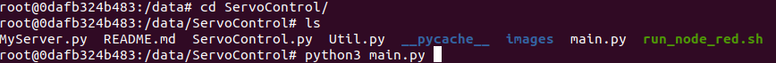
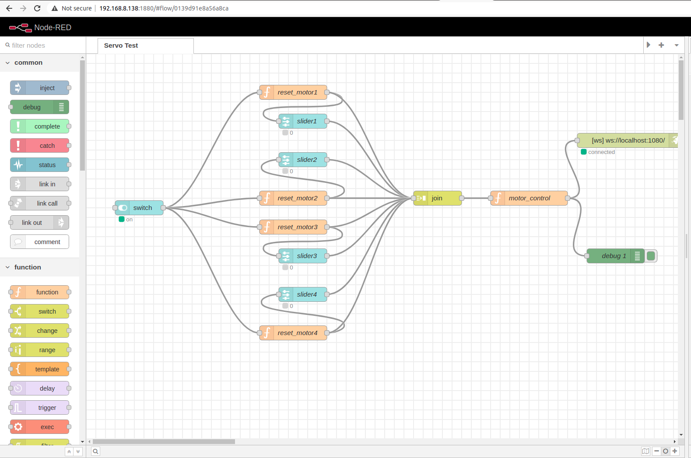
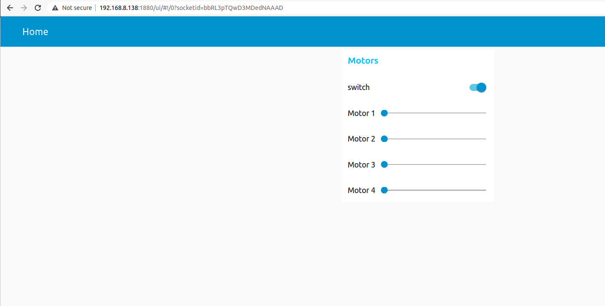

# ServoControl

## Environment setup

Jetpack version 4.4.1 <br>

Install Adafruit ServoKit library by following this repository: https://github.com/JetsonHacksNano/ServoKit <br>

Install nodejs and nodered <br>

Or just simply pull the docker image to your jetson nano: docker pull longpth/rbtln:latest, this image already contains all the necessary installation <br>

## Run the docker container in Jetson Nano

Modify run_node_red.sh regarding "-v ~/node-red-test/node_red_data/ServoControl:/data" respectively to share this repository with /data inside docker container. <br>
Then run it. <br>

```console
./run_node_red.sh
```

Inside the docker container, run <br>

```console
cd /data
```

Then run the main function by <br>

```console
python3 main.py
```



## Run the Node-red UI and flow pages

Open a web browser in your PC or smart phone, then type the ip address of your jetson-nano board as <ipaddress>:1880 for flow page, or <ipaddress>:1880/ui for UI page.

 
